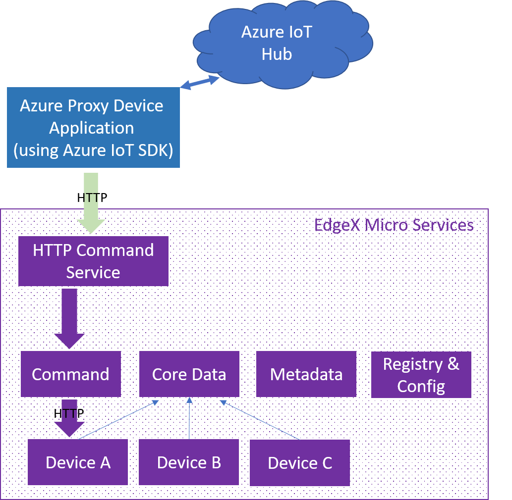

# HTTP Command Service #

#### Overview ####

Many IoT deployments require some form of integration with the cloud. The integration will be required for both north- and south bound integration.  For south-bound services, after analytic processing from the cloud, some device actions are notmally triggered as a result of gathered intelligence. This document demonstrates a sample EdgeX application service–HTTP Command Service that can receive commands from the Azure IoT Hub, consume the device data and invoke commands against devices. The entire technical architecture is illustrated below:



We sometimes want to trigger device actions from the cloud; that is, from the Azure IoT Hub to EdgeX. The EdgeX Core Command Service provides a comprehensive set of APIs to achieve this. However, in some cases, you might prefer not to expose all APIs and therefore require a finer-grained control over the APIs to be exposed. For example, you might want to control the commands on specific devices that can receive commands from outside of EdgeX, or to allow only certain values for a specific command.  HTTP Command Service provides a sample implementations to achieve such control.

#### Prerequisites ####

* Obtain the code from the https://github.com/edgexfoundry-holding/app-service-examples repo
* Ensure that EdgeX is running with mandatory services, including core services and logging service
* Ensure that the Virtual Device Service is running and managed by EdgeX with at least one pre-defined device, such as Random-Boolean-Device<br>

If you are unfamiliar with the Azure IoT Hub, read the following documents first, as this document intentionally omits some details on Azure:
* [Create an Azure IoT Hub on the Azure portal](https://docs.microsoft.com/en-us/azure/iot-hub/iot-hub-create-through-portal)
* [Set up X.509 security on Azure IoT Hub](https://docs.microsoft.com/en-us/azure/iot-hub/iot-hub-security-x509-get-started)

#### Steps ####

1. The HTTP Command Service exposes an HTTP service for the client to switch on / off of the device without knowing the underlying EdgeX APIs. For the service to send commands to correct device, you must set DeviceID and CommandID in the res/configuration.toml file. 
   **Note:** For real use cases, the DeviceID must be associated with the actual device that is managed by EdgeX; the CommandID must be associated with the required command registered under the EdgeX Core Command Service, and the command must provide correct responses to consume the [switch on / off JSON document](https://github.com/edgexfoundry-holding/app-service-examples/blob/master/app-services/http-command-service/status-on-request.json). For simplicity, we can use the Virtual Device Service here.
    ```
     [ApplicationSettings]
     DeviceID = "9f178953-84e7-49f6-9829-5b86b7cbbcda"
     CommandID = "15786a22-d89b-474b-a7de-18371c3d22c5"
    ```
2. Build the HTTP command service by refering to [here](https://github.com/edgexfoundry-holding/app-service-examples#building-examples). 
3. Run the http-command service by refering to [here](https://github.com/edgexfoundry-holding/app-service-examples#running-an-example), and you have an HTTP service that can switch on/off your device by sending a [JSON payload](https://github.com/edgexfoundry-holding/app-service-examples/blob/master/app-services/http-command-service/status-on-request.json) to the http://127.0.0.1:48095/api/v1/trigger endpoint.
4. With the HTTP Command Service ready, your Azure IoT Hub can use a direct method to control the device. Azure provides an IoT device SDK in various programming languages. Refer to [Quickstart: Control a device connected to an Azure IoT hub with Java](https://docs.microsoft.com/en-us/azure/iot-hub/quickstart-control-device-java) for more details of using the direct method.  To simplify the implementation, we supply modified code, which is ready to run with the Azure IoT hub:
   * Under iot-hub directory, there are two modules:
     * Quickstarts/proxy-device<br>
       This simulates an Azure device that is associated with the proxy device as defined in step 1, and this proxy device could be used to handle remote methods.
     * Quickstarts/back-end-application<br>
       This is a simulated Azure back-end application that issues remote method requests.
   * Follow the steps as described [here](https://docs.microsoft.com/en-us/azure/iot-hub/quickstart-control-device-java#register-a-device) to register a proxy device on your Azure IoT hub
   * Update the **connection string** and **device Id** as obtained from previous step for both following Java classes:
     * Quickstarts/proxy-device/src/main/java/com/microsoft/docs/iothub/samples/ProxyDevice.java<br>
       ```java
       public class ProxyDevice {
              // The device connection string to authenticate the device with your IoT hub.
              // Using the Azure CLI:
              // az iot hub device-identity show-connection-string --hub-name {YourIoTHubName} --device-id {YourDeviceId} --output table
              private static String connString = "{Your device connection string here}";
       ```
     * Quickstarts/back-end-application/src/main/java/com/microsoft/docs/iothub/samples/BackEndApplication.java<br>
       ```java
        public class BackEndApplication {
         
          // Connection string for your IoT Hub
          // az iot hub show-connection-string --hub-name {your iot hub name} --policy-name service
          public static final String iotHubConnectionString = "{Your service connection string here}";
           
          // Device to call direct method on.
          public static final String deviceId = "{Your device Id here}";
       ```
   * Run ``mvn clean package`` in both 2 modules
   * Use following scripts to run the applications:
     * Quickstarts/proxy-device/run.sh<br>
       This initiates the proxy device that is defined on the Azure IoT Hub. This device acts as a proxy to invoke the HTTP Command Service using the http://127.0.0.1:48095/api/v1/trigger endpoint
     * Quickstarts/back-end-application/on.sh<br>
       This simulates the switch-on request from the Azure IoT Hub. A successful request makes a device method invocation to switch on the device.
     * Quickstarts/back-end-application/off.sh<br>
       This simulates the switch-off request from the Azure IoT Hub. A successful request makes a device method invocation to switch off the device.